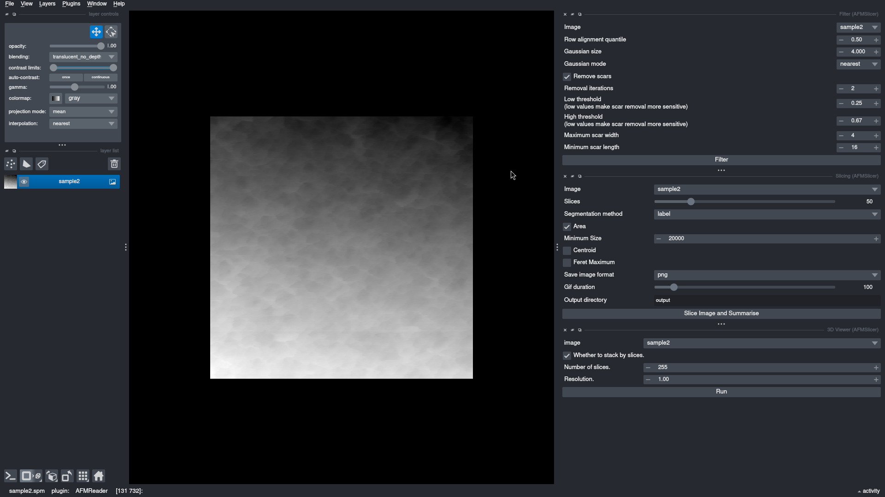
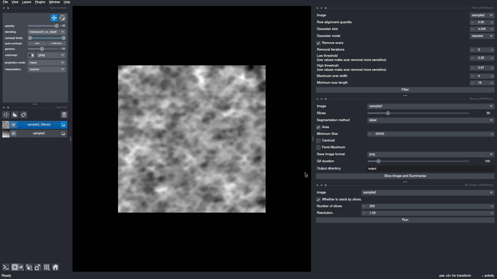
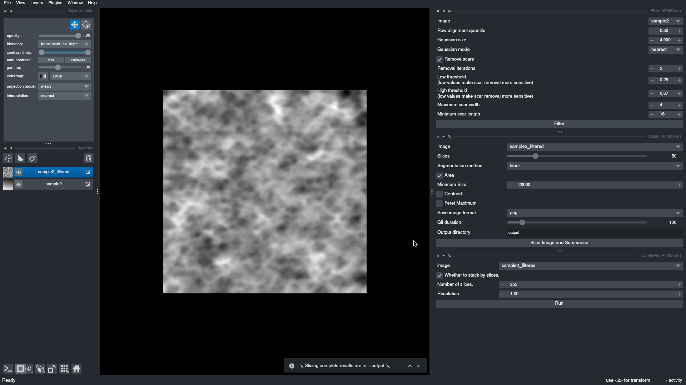
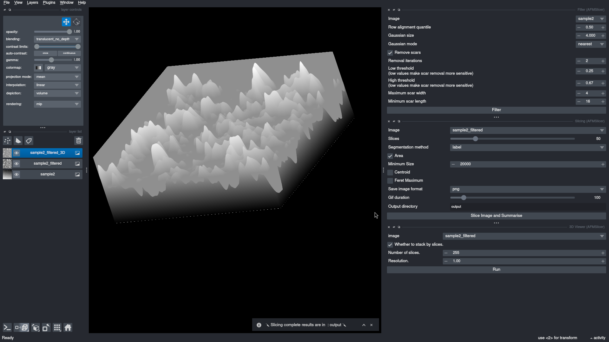

# Napari

[Napari][napari] is an extensible framework for viewing, processing and manipulating images and we have developed a
plugin to use AFMslicer in Napari, [napari-afmslicer][napari_afmslicer].

## Installation

We publish [napari-afmslicer][napari_afmslicer] to PyPI and in turn it appears in the [Napari Hub][napari_hub]. You can
then install it from the _Plugins > Install/Uninstall Plugins_ menu item of Napari.

### Dependencies

We include a small selection of plugins as dependencies and these will have been installed automatically when following
the [installation](../installation.md) instructions.

- [napari-afmreader][napari_afmreader] - used to load a range of Atomic Force Microscopy images.
- [napari-crop][napari_crop] - used for cropping images (typically prior to filtering and slicing).
- [napari-skimage][napari_skimage] - Napari interface to [Scikit Image][skimage] functions.
- [napari-topostats][napari_topostats] - required as some of the functionality is reused.

The `napari-crop` and `napari-skimage` plugins in particular may be of use to further pre-process images prior to slicing.

## Usage

### Launching

You can launch Napari from the command line within your Virtual Environment.

``` shell
napari
```

You can automatically load the Napari AFMSlicer widgets using...

``` shell
napari -w napari-afmslicer __all__
```

This will bring up the widgets on the right-hand side. At the bottom are three tabs allowing you to switch between the
_Filtering_, _Slicing_ and _3D Viewer_ components.



Alternatively the widgets can be launched from the menu under _Plugins > AFMSlicer >_ from which you can enable each
components of the plugin. Currently there are three components, each of which can be enabled independently.

- 3D Viewer
- Filter
- Slicing

The difference is that the options for each of the components are stacked on the right rather than being tabbed.


A typical workflow will
involve...

1. Filtering an image and removing scars
2. Running slicing.

Hovering over any of the text associated with the options will show a short explanation of what it does.

### Filtering

The parameters for filtering can be configured easily. Unchecking _Remove scars_ will prevent scar removal from running
completely. Once you have adjusted the parameters to your preference click on the _Filter_ button and the image will be
filtered and a new layer will appear listed on the left and automatically selected showing the effects of filtering. It
will have the original images name suffixed with `_filtered`



### Slicing

Under the _Slicing_ widget select the filtered image from the pull-down list to the right of _Image_ (typically it will
be the layer with the `_filtered` suffix). Next select the number of _Slices_ to create, the _Segmentation method_
(`label` is the most common) and other options, in particular the _Output directory_ should be explicitly set. When
ready click the _Slice Image and Summarise_, the image will be sliced and summarised with the output saved to the
parameter in the _Output directory_ field.



### 3D Viewer

The 3D viewer can be used to view the images in three dimensions. Select the `_filtered` layer for the _Image_ to be
viewed and a number of slices to create this image with (it can be different to those the slicing was performed with).



[napari]: https://napari.org/stable/
[napari_afmreader]: https://github.com/AFM-SPM/napari-AFMReader/
[napari_afmslicer]: https://github.com/AFM-SPM/napari-afmslicer
[napari_crop]: https://napari-hub.org/plugins/napari-crop.html
[napari_hub]: https://napari-hub.org/
[napari_skimage]: https://napari-hub.org/plugins/napari-skimage.html
[napari_topostats]: https://github.com/AFM-SPM/napari-TopoStats/
[skimage]: https://scikit-image.org/
