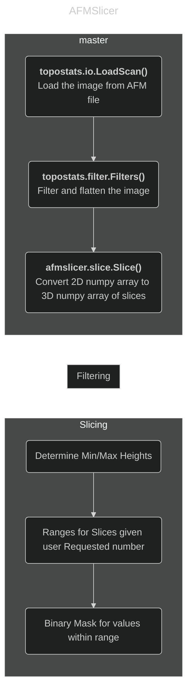

# Workflow

The overall workflow of processing an image with AFMSlicer is shown
below.[^mermaid]

[^mermaid]:
    If modifying this diagram it is recommended to copy and paste the existing
    code and adjust in the [mermaid.live][mermaid_live] online tool.

[mermaid_live]: https://mermaid.live
